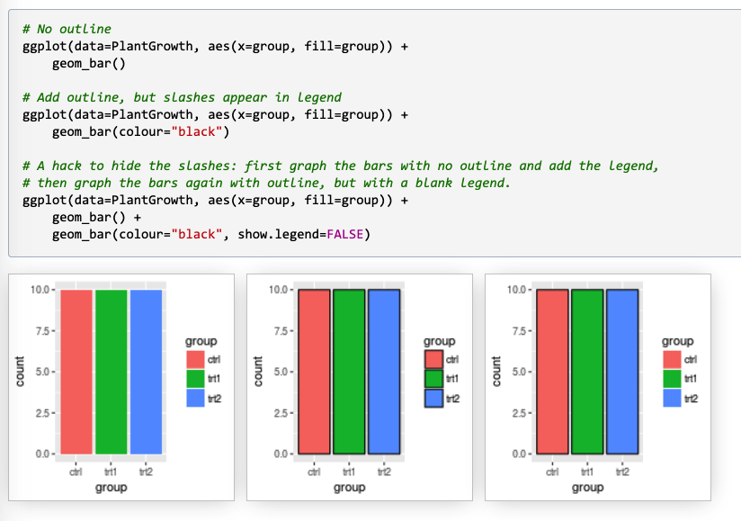

<!-- README.md is generated from README.Rmd. Please edit that file -->


# rmapping

<!-- badges: start -->

<!-- badges: end -->

These are a collection of functions that are used repeatedly but easily
forgotten. To be explicit, the names of the functions are often long but
should be clear about what each of them does. Most of the functions are intended for mapping and heavily dependent on `ggplot2`. 

## Installation

``` r
install_github ('seunjeong/rmapping')
```

## Some Tricks for ggplot2

How to control the outline for the discrete legend.


Source: http://www.cookbook-r.com/Graphs/Legends_(ggplot2)/

## Useful Resources for R Plot General

<http://www.cookbook-r.com/Graphs/Legends_(ggplot2)/>
